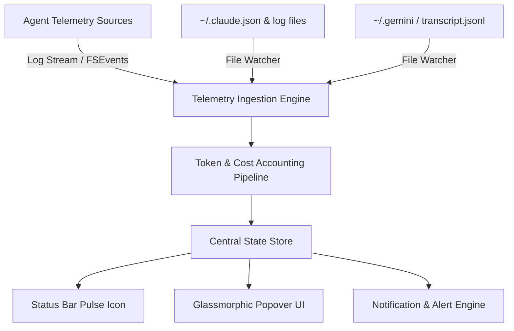

# AgentBar / AgentPulse — Product Specification & Technical Architecture

> **Superseded for the current app by [README.md](README.md).** This file is the earlier target. The README is the product definition of what this folder actually ships.

> **Document Type:** AI Product Requirement Document (PRD) & Technical Specification  
> **Inspired By:** Shubham Saboo's AI-Native Product Framework (Google Cloud AI PM Blueprint)  
> **Status:** Draft / Active Specification  
> **Target Platform:** macOS (v14.0+)  

---

## 1. Executive Summary & Vision

**AgentBar** (internally *AgentPulse*) is a lightweight, high-performance native macOS menu bar application designed for developers using AI coding agents (such as **Claude Code**, **Gemini CLI / Antigravity**, **Cursor**, and **OpenAI CLI tools**).

### The Problem
As developers rely heavily on background AI agents for pair programming, test generation, and autonomous coding tasks, tracking **token consumption**, **API costs**, **budget burn rates**, and **active agent status** requires navigating terminal logs, web dashboards, or checking third-party usage portals.

### The Solution
AgentBar provides real-time ambient visibility into AI agent operations directly from the macOS status bar. It presents a live pulse of active agent sessions, real-time token metrics, estimated dollar costs, budget progress, and customizable alert thresholds—all wrapped in a sleek glassmorphic macOS native UI.

---

## 2. Target Audience & Core Use Cases

| User Persona | Primary Need | Core Capability Used |
| :--- | :--- | :--- |
| **AI-Assisted Engineer** | Wants to know if a background agent is currently generating code or idle. | Ambient status bar pulse indicator & active session monitor. |
| **Freelancer / Indie Hacker** | Needs to avoid unexpected API bills while running large agent tasks. | Real-time cost estimator & daily budget cap alerts. |
| **Engineering Lead** | Wants visibility across multiple agents (Claude Code, Gemini CLI, etc.). | Multi-agent tab view and unified telemetry aggregator. |

---

## 3. Product Capabilities & Technical Feature Matrix



### 3.1. Ambient Menu Bar Pulse (`NSStatusItem`)
- **Status Indicator:** Animated status bar icon displaying agent state:
  - 🟢 **Active / Streaming:** Agent actively processing or generating code.
  - 🟡 **Idle / Waiting:** Agent waiting for user input or approval.
  - 🔴 **Error / Rate Limited:** API error, 503 capacity limit, or budget cap reached.
- **Quick Badge:** Shows live token count or session cost right in the status bar (optional user preference).

### 3.2. Popover Dashboard (`SwiftUI` + Glassmorphism)
- **Agent Overview Card:** Live metrics for the primary active agent (Tokens today, Est. cost, Budget %).
- **Multi-Agent Breakdown:** Switchable views for **Claude Code**, **Gemini CLI**, **Cursor / Custom Agents**.
- **Daily Budget Meter:** Visual progress bar against customizable daily cost targets ($5.00/day default).
- **Session History:** Recent prompt sessions with duration, input/output token counts, and costs.

### 3.3. File Observer & Telemetry Parser Engine
- Zero-latency local file monitoring using macOS `DispatchFileSystemObject` / `FSEvents`.
- Native log parsers for:
  - **Claude Code:** Parsers for `~/.claude/logs/`, `~/.claude.json`, and prompt history files.
  - **Gemini CLI / Antigravity:** Parsers for local `transcript.jsonl` and session manifests.
  - **Custom Agent Adapter:** Schema-driven JSON parser for custom CLI agents logging usage.

### 3.4. Cost Engine & Pricing Registry
- Built-in pricing tables with automatic updates for popular LLM models:
  - `claude-3-5-sonnet`, `claude-3-7-sonnet`, `claude-3-opus`
  - `gemini-1.5-pro`, `gemini-2.0-flash`, `gemini-3.6-flash`
  - `gpt-4o`, `o1`, `o3-mini`
- Supports cache token discount rules (e.g., Anthropic prompt caching discounts).

---

## 4. System Architecture & Technical Stack

### 4.1. Technology Selection

| Component | Framework / Technology | Rationale |
| :--- | :--- | :--- |
| **Language & Runtime** | Swift 5.9+ / Swift 6 | Native macOS execution, minimal CPU/memory footprint (< 30MB RAM). |
| **UI Framework** | SwiftUI + AppKit (`NSStatusItem`, `NSPopover`) | Native glassmorphism visuals (`NSVisualEffectView`) and smooth 60fps animations. |
| **Concurrency Model** | Swift Concurrency (`async/await`, `Actor`) | Thread-safe state updates without blocking UI main loop. |
| **File Watcher** | `DispatchSourceFileSystemObject` / `Combine` | Efficient event-driven file monitoring without aggressive polling. |
| **Storage** | `UserDefaults` + `SwiftData` / `SQLite` | Fast local caching of daily metrics and cost history. |

### 4.2. File Layout

```
AgentPulse/
├── Package.swift               # SPM Manifest
├── Info.plist                  # macOS App Bundle Config (LSUIElement = true)
├── Sources/
│   └── AgentPulse/
│       ├── AgentPulseApp.swift # Main Entry Point & NSApplicationDelegate
│       ├── UI/
│       │   ├── PopoverView.swift     # Glassmorphic Main Dashboard
│       │   ├── StatusItemManager.swift# Status Bar Icon & Menu Controller
│       │   └── Components/          # Metric Cards, Progress Bars, Badges
│       ├── Core/
│       │   ├── TelemetryEngine.swift# File System Watcher & Event Loop
│       │   ├── Parsers/             # ClaudeCodeParser, GeminiParser
│       │   ├── PricingRegistry.swift# Model Pricing & Cost Calculator
│       │   └── StateStore.swift     # @Observable Central State
│       └── Models/
│           └── AgentMetrics.swift   # Data Transfer Objects & Enums
├── Tests/
│   └── AgentPulseTests/       # Unit & Integration Tests
└── Scripts/
    └── bundle.sh               # App Packaging & Ad-hoc Signing
```

---

## 5. Implementation Roadmap (Phases 1-4)

### Phase 1: Core Shell & Build Reliability (Current Sprint)
- [x] Create native `NSStatusItem` & `NSPopover` shell.
- [ ] Fix SwiftUI syntax errors (`Image(systemName:)`) and CLI build manifests.
- [ ] Implement standalone app bundler script (`bundle.sh`).

### Phase 2: Telemetry Ingestion & Log Parsers
- [ ] Build `FileWatcher` utility for monitoring `~/.claude/` and `~/.gemini/` directories.
- [ ] Implement JSON Lines / JSON parser for Claude Code log streams.
- [ ] Wire `StateStore` to calculate live token counts dynamically.

### Phase 3: Cost Accounting & Alerting
- [ ] Implement `PricingRegistry` with model-specific cost rates (Input, Output, Cache).
- [ ] Implement daily budget progress calculation & configurable limits.
- [ ] Add macOS system notifications (`UNUserNotificationCenter`) when budget thresholds (80%, 100%) are breached.

### Phase 4: Polish & Customization
- [ ] Add preferences panel for configuring monitored log paths and model rates.
- [ ] Refine Glassmorphism visual effect and animated pulse status icon.
- [ ] Add launch-at-login capability (`SMAppService`).

---

## 6. Success Metrics & Definition of Done

1. **Memory & CPU Footprint:** Memory usage < 35 MB, background CPU usage < 0.5%.
2. **Latency:** File change to UI metric update delay < 100 milliseconds.
3. **Reliability:** 0 main-thread blocking calls, unit test coverage > 80% on core parsers and pricing engine.
